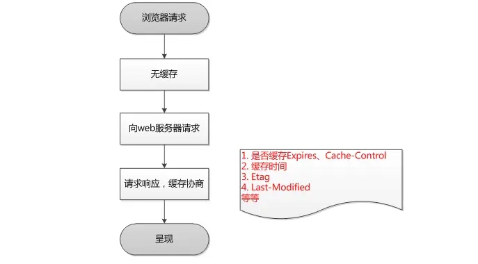
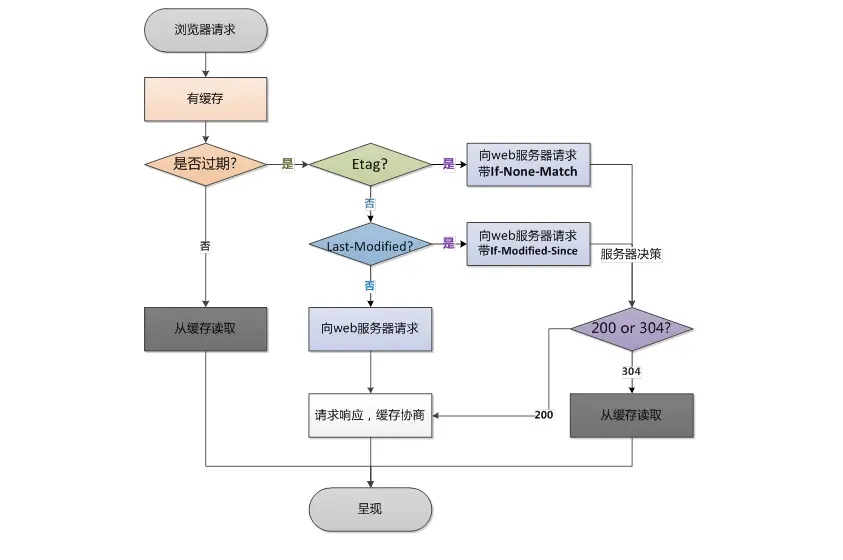
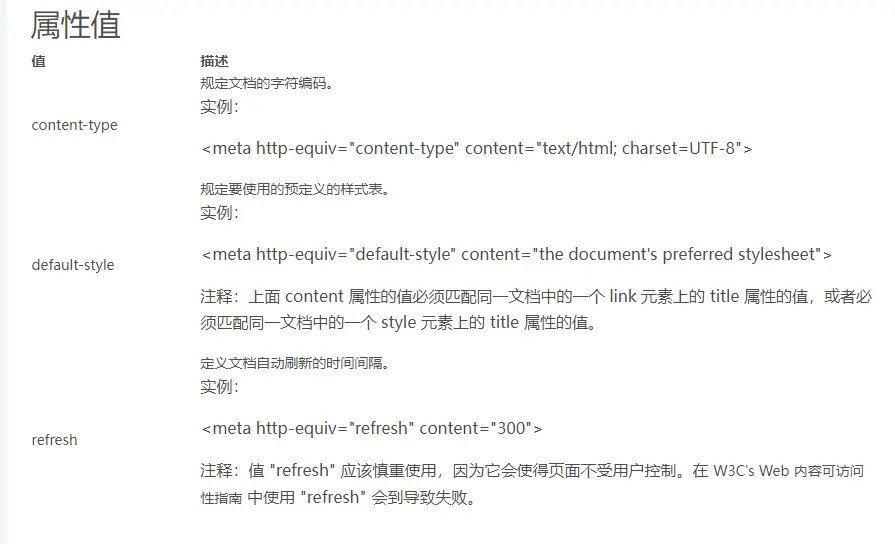

## 一、 强缓存与协商缓存的含义

### 1. 什么是缓存

我们常说的缓存，缓存一般都是根据浏览器来说的，当我们第一次访问网站的时候，程序会把网站上的图片和数据会下载到电脑上，如果我们再次访问网站的时候，网站就会从本地直接加载出来，这就是缓存。

### 2. 什么是浏览器缓存

浏览器缓存是为了节约资源,并且可以加速浏览网站的速度,当用户第一次进行访问网页的时候,浏览器在用户磁盘上对请求的文档进行保存,当用户第二次访问的时候，就会从本地直接显示，从而提高了访问页面的速度。

### 3. 什么是强缓存

服务器通过设置 http 中 hdader 的 Expires 和 cache-control 字段告诉浏览器换存的有效期。这种方法会有一个固定时间，所带来的问题是如果服务器数据进行了更新，但是还没有到强缓存的过期时间，则数据无法更新

#### 3.1 Expires

Expires 是 Web 服务器响应消息头字段，在响应 http 请求时告诉浏览器在过期时间前浏览器可以直接从浏览器缓存取数据，而无需再次请求。
Expires 的值是 GMT 格式的绝对时间，在设置的时间前浏览器会直接使用本地缓存。

#### 3.2 cache-control

cache-control 有 12 个值，其中的 max-age 值定义缓存的有效期，单位是秒，例如：cache-control：max-age=700，它表示缓存有效期为 700 秒，以消息的生成日期为基准，也就是 header 中的 Date 字段。

cache-control 与 Expires 的区别在于 cache-control 的值是相对时间，而 Expires 是绝对时间，如果我们人为的修改了本地的时间，那么此时本地的时间与服务器上的时间不一致，就会导致缓存不能正确的被使用；而如果用相对时间，不管怎么改变本地的时间，缓存的有效期都不会改变。

### 4.什么是协商缓存

简单的说，协商缓存就是通过服务器来判断缓存是否可用。

#### 4.1Last-Modified：

表示这个响应资源的最后修改时间，web 服务器在响应请求时，告诉浏览器资源的最后修改时间。

If-Modified-Since：当资源过期时（使用 Cache-Control 标识的 max-age），发现资源具有 Last-Modified 声明，则再次向 web 服务器请求时带上头 If-Modified-Since，表示请求时间。web 服务器收到请求后发现有头 If-Modified-Since 则与被请求资源的最后修改时间进行比对。若最后修改时间较新，说明资源又被改动过，则响应整片资源内容（写在响应消息包体内），HTTP 200；若最后修改时间较旧，说明资源无新修改，则响应 HTTP 304 (无需包体，节省浏览)，告知浏览器继续使用所保存的 cache。

#### 4.1 Etag/If-None-Match

Etag/If-None-Match 也要配合 Cache-Control 使用。

Etag：web 服务器响应请求时，告诉浏览器当前资源在服务器的唯一标识（生成规则由服务器觉得）。Apache 中，ETag 的值，默认是对文件的索引节（INode），大小（Size）和最后修改时间（MTime）进行 Hash 后得到的。

If-None-Match：当资源过期时（使用 Cache-Control 标识的 max-age），发现资源具有 Etage 声明，则再次向 web 服务器请求时带上头 If-None-Match （Etag 的值）。web 服务器收到请求后发现有头 If-None-Match 则与被请求资源的相应校验串进行比对，决定返回 200 或 304。

## 二、缓存机制

缓存这东西，第一次必须获取到资源后，然后根据返回的信息来告诉如何缓存资源，可能采用的是强缓存，也可能告诉客户端浏览器是协商缓存，这都需要根据响应的 header 内容来决定的。下面用两幅图来描述浏览器的缓存是怎么玩的，让大家有个大概的认知。

### 浏览器第一次请求时：



### 浏览器后续在进行请求时：



## 那么前后端具体如何实现 HTTP 缓存？ 看下面

### 1.前端如何实现 HTTP 缓存：

前端设置 http 缓存,前端设置 html 页面缓存方法：静态的 html 页面想要设置使用缓存需要通过 HTTP 的 META 设置 expires 和 cache-control

设置如下网页元信息:

```html
<meta http-equiv="Cache-Control" content="max-age=7200" />
<meta http-equiv="Expires" content="Mon, 20 Jul 2013 23:00:00 GMT" />
```

解答:

cache-control：||no-cache||no-store||max-age

1.no-cache：

表面意为“数据内容不被缓存”，而实际数据是被缓存到本地的，只是每次请求时候直接绕过缓存这一环节直接向服务器请求最新资源，由于浏览器解释不一样，

例如 ie 中我们设置了 no-cache 之后，请求虽然不会直接使用缓存，但是还会用缓存数据与服务器数据进行一致性检测(也就是说还是有几率会用到缓存的),

firefox 中则完全无视 no-cache 存在，详细解释见 no-store;

2.no-store：

指示缓存不存储此次请求的响应部分。与 no-cache 比较来说，一个是不用缓存，一个是不存储缓存;按理来说这个设置更加粗暴直接禁用缓存，

但是具体实现起来 浏览器之间差异却特别大，一般不会直接用该字段进行设置，不过 no-store 是为了防止缓存被恶意修改存储路径导致信息被泄露而设置的，

毕竟有它的用处，在 firefox 中实现缓存是通过文件另存为将缓存副本保存到本地，直接利用 no-cache 对其是无效的，如果加上 no-store 设置的话 则可以起到与 no-cache 一样的效果;

即：cache-control:no-cache,no-store;可以确保在支持 http1.1 版本中各大浏览器回车后退刷新无缓存；

再加上 Pragma: no-cache 设置兼容版本 1.0 即可(不过为了防止一致性检测时候的万一我们还是最好加上一致性检测的内容，如下所示几种方式)；

3.max-age：

例如 Cache-control: max-age=3；表示此次请求成功后 3 秒之内发送同样请求不会去服务器重新请求，而是使用本地缓存；同样我们如果设置 max-age=0 表示立即抛弃缓存直接发送请求到服务器

以下内容来自:http://www.runoob.com/tags/att-meta-http-equiv.html

HTML `<meta>` 标签](http://www.runoob.com/tags/tag-meta.html)

## 实例

每隔 30 秒刷新一次文档：

```html
<head>
  <meta http-equiv="refresh" content="30" />
</head>
```

所有主流浏览器都支持 http-equiv 属性。

## 定义和用法

http-equiv 属性提供了 content 属性的信息/值的 HTTP 头。

http-equiv 属性可用于模拟一个 HTTP 响应头。

## HTML 4.01 与 HTML5 之间的差异

使用 http-equiv 已经不是规定 HTML 文档的字符集的唯一方式：

HTML 4.01：` <meta http-equiv="content-type" content="text/html; charset=UTF-8">`
HTML5： `<meta charset="UTF-8">`

### 语法

```html
<meta http-equiv="content-type|default-style|refresh" />
```



以下场景均不能做浏览器缓存：
1.HTTP 信息头中包含 Cache-Control:no-cache，pragma:no-cache，或 Cache-Control:max-age=0 等告诉浏览器不用缓存的请求 2.需要根据 Cookie，认证信息等决定输入内容的动态请求是不能被缓存的 3.经过 HTTPS 安全加密的请求，也存在例外情况
4.POST 请求无法被缓存
5.HTTP 响应头中不包含 Last-Modified/Etag，也不包含 Cache-Control/Expires 的请求无法被缓存

## 2.后端如何实现 HTTP 缓存：

请参考 https://juejin.im/entry/5a13be3bf265da432d27b7ec
