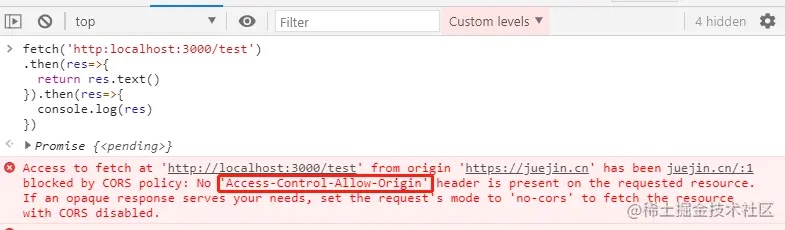

## 一、安装 express 库和生成器

打开 cmd 输入命令:

```bash
npm i -g express express-generator
```

> 解释： 上面里两个模块分别表示库和生成器，在 express3 时，安装 express 会自动的给你安装生成器 express-generator ，但是在 express4 时，他们就被分开了，所以需要分别安装。

安装好后可以通过命令：

```bash
express --version
```

检查是否安装成功。

出现版本号即为安装成功（如下图所示）。


## 二、express 生成器自动创建 express 项目

输入命令：

```bash
express nodejs
```

如下图所示即为成功）


成功之后的目录：


## 三、跳转到 package.json 目录下安装相关的包

输入命令：

```bash
npm i
```

## 四、启动项目

输入命令：

```bash
npm run start
```

打开浏览器，访问 127.0.0.1:3000 就能获取访问我们的项目了

## 五、项目目录解释

> bin：存放可执行文件
> public：存放 js、css、img 等文件
> router：存放路由文件
> views：存放视图文件或者说模版文件
> app.js：启动文件（入口文件）
> package.json：存储着工程的信息及模块依赖，当在 dependencies 中添加依赖的模块时，运行  npm install，npm 会检查当前目录下的 package.json，并自动安装所有指定的模块
> node_modules：存放 package.json 中安装的模块，当你在 package.json 添加依赖的模块并安装后，存放在这个文件夹下

参考链接: https://www.cnblogs.com/shimily/articles/5541681.html

## 六、在此项目中如何开发

首先在 routes 中新建一个 test.js 文件

```js
var express = require('express')
var router = express.Router()

router.get('/', function (req, res, next) {
  res.send('我是接口返回值')
})

module.exports = router
```

然后在 app.js 中加入下面代码

```js
var testRouter = require('./routes/test')

app.use('/test', testRouter)
```


然后打开浏览器控制台用 fetch 请求我们刚才写的接口

```js
fetch('http:localhost:3000/test')
  .then((res) => {
    return res.text()
  })
  .then((res) => {
    console.log(res)
  })
```

我们发现出现了跨域问题，这是因为我们在 nodejs 中没有添加跨域所导致的。



将下面的跨域的代码添加到 app.js 中

```js
//设置跨域访问（设置在所有的请求前面即可）
app.all('*', function (req, res, next) {
  //设置允许跨域的域名，*代表允许任意域名跨域
  res.header('Access-Control-Allow-Origin', '*')
  //允许的header类型
  res.header('Access-Control-Allow-Headers', 'content-type')
  //跨域允许的请求方式
  res.header('Access-Control-Allow-Methods', 'DELETE,PUT,POST,GET,OPTIONS')
  if (req.method == 'OPTIONS') {
    res.sendStatus(200) //让options尝试请求快速结束
  } else {
    next()
  }
})
```

然后重启一下项目，这样就可以正常访问了


在项目中修改了内容就需要我们手动重启项目，有点麻烦，我们再安装一个插件即可解决这个烦恼。

## 七、使用 nodemon 自动重启服务

安装 nodemon 模块
输入命令：

```bash
npm i nodemon
```

创建 nodemon.json 文件
在项目的根目录下创建：nodemon.json 文件

```js
{
	"restartable": "rs",
	"ignore": [".git", ".svn", "node_modules/**/node_modules"],
	"verbose": true,
	"execMap": {
		"js": "node --harmony"
	},
	"watch": [],
	"env": {
		"NODE_ENV": "development"
	},
	"ext": "js json njk css js "
}
```

使用 nodemon 模块

在你的 package.json 文件中，添加一行脚本代码

```
"dev": "nodemon ./bin/www"
```


输入命令：

```bash
npm run dev
```
