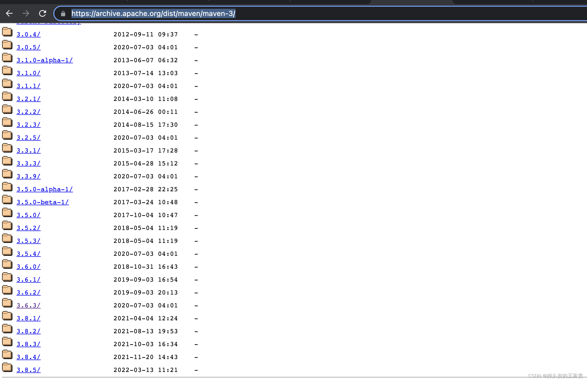
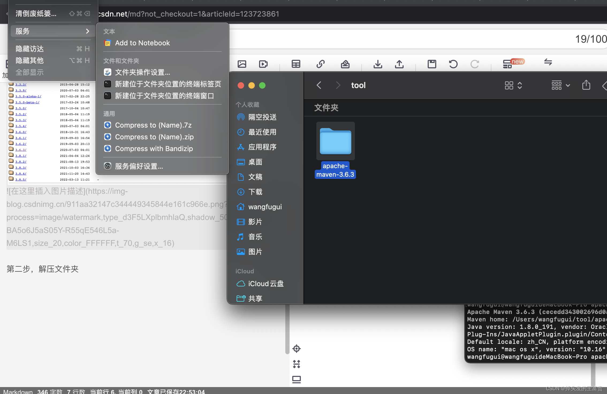
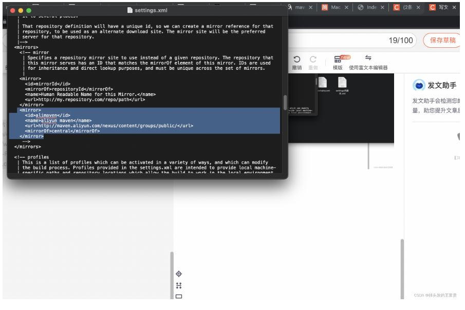
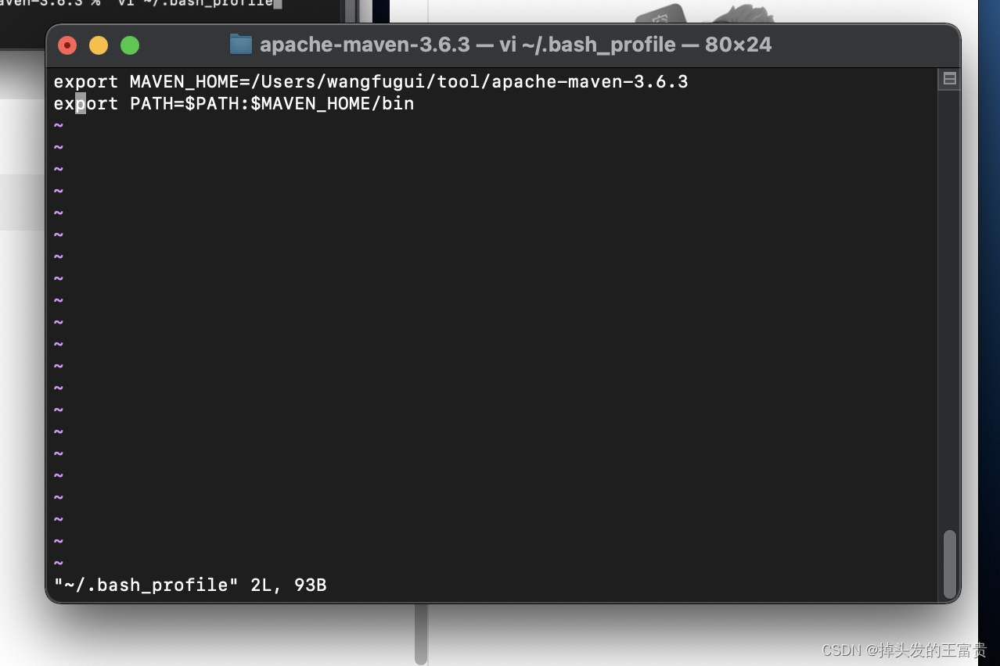
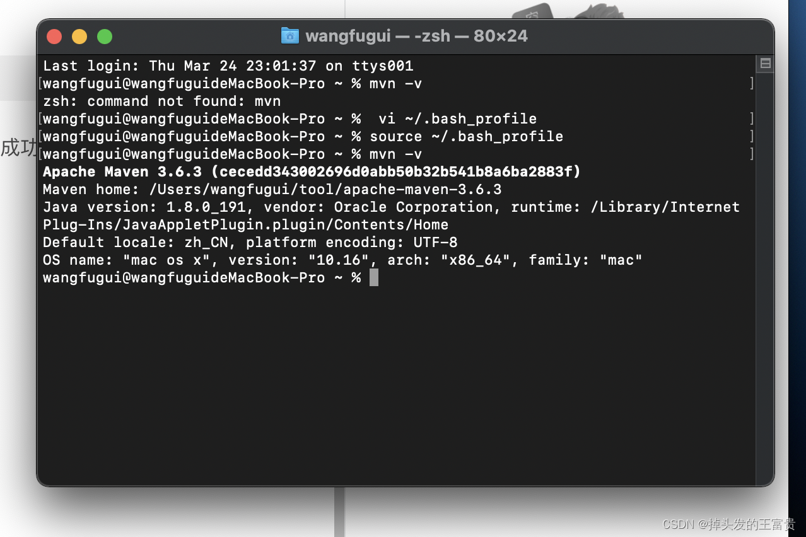
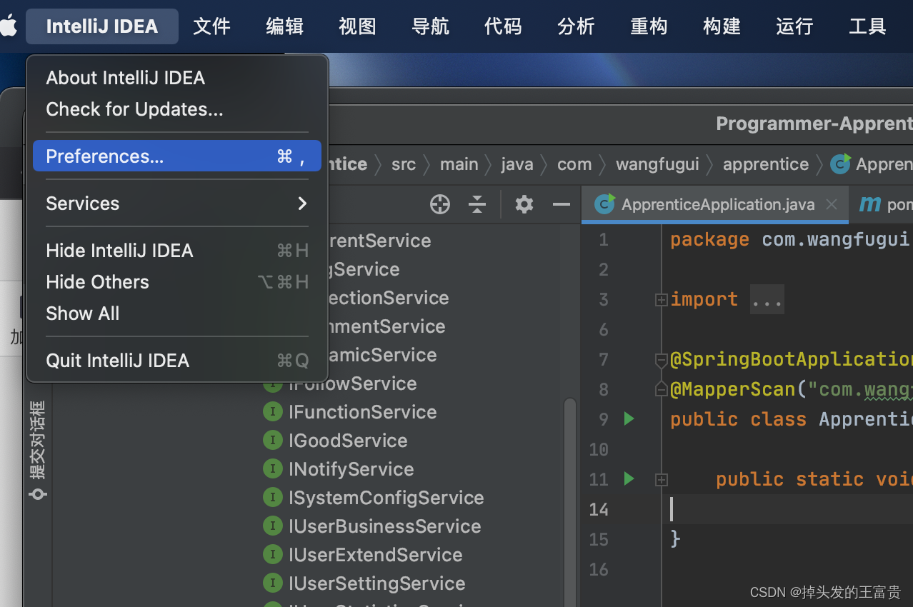
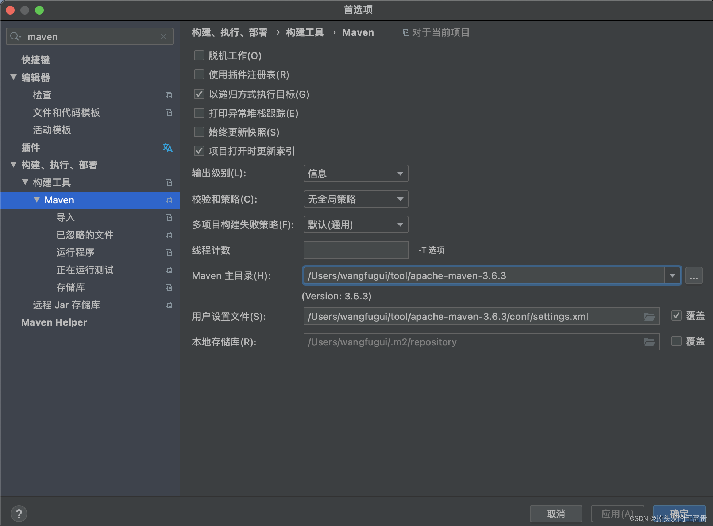

## Mac 安装 Maven

### 第一步，下载安装包

<https://archive.apache.org/dist/maven/maven-3/>  
这里我们下载的是 3.6.3 版本的



### 第二步，解压文件夹



```bash
tar -zxvf apache-maven-3.6.3-bin.tar.gz
```

### 第三步，编辑 setting 文件添加国内镜像



```xml
<mirror>
    <id>alimaven</id>
    <name>aliyun maven</name>
    <url>http://maven.aliyun.com/nexus/content/groups/public/</url>
    <mirrorOf>central</mirrorOf>
</mirror>
```

### 第四步，配置环境变量



```bash
export MAVEN_HOME=/Users/wangfugui/tool/apache-maven-3.6.3
export PATH=$PATH:$MAVEN_HOME/bin
```

### 第五步，刷新配置文件

```bash
source ~/.bash_profile
```

最后输入 mvn -v 查看 Maven 是否安装成功



### 第六步，idea 配置 maven





完成！
