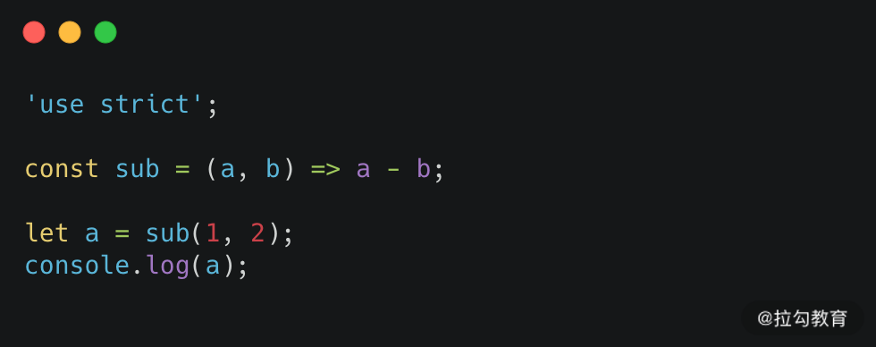

随着前端生态的不断发展，以及前端工程化持续不断迭代升级，提升整体研发效率成为了前端研发团队里面所有成员都无法忽视的问题，业界也不断涌现出了越来越多的方案。

比如在“构建”这个方向上，Vue 作者尤雨溪代领团队开发的新一代构建工具 Vite 开始进入大家的视野，在整个前端社区也得到了热烈的讨论。

> Vite 是一种新型前端构建工具，能够显著提升前端开发体验。它主要由两部分组成：
> 一个开发服务器，基于原生 ES 模块提供了丰富的内建功能，如速度非常快的模块热更新（HMR）
> 一套构建指令，使用 Rollup 打包你的代码，并且它是预配置的，可输出用于生产环境的高度优化过的静态资源

这里就出现了我今天给大家分享的主角：Rollup。

Rollup 的了解是至关重要的，不仅是因为 Vite 采用 Rollup 来打包；还有一些场景，比如我们想要编写一些 Vite 插件的时候，也需要对 Rollup 有一定的了解和积累。这是因为 Vite 插件是在 Rollup 的基础上进行扩展的，也就是在 Rollup 的基础上增加了一些 Vite 独有的配置项。除此之外，在 Webpack 占领绝大多数前端工程构建选型的今天，Rollup 仍然是许多主流 JS 库的打包方案，包括我们目前熟悉的 Vue、React 等主流框架。

究竟 Rollup 的优势和特点体现在哪里呢？又要如何应用呢？让我们来详细地了解一下。

### Rollup 是什么

### Rollup 定位

Rollup 的定位是一个用于 JavaScript 的模块打包器；而 Webpack 的定位是 JavaScript 应用程序的模块打包器。下面是引用了在 Rollup 和 Webpack 官方文档上对各自的定义。

> // Rollup
> Rollup is a module bundler for JavaScript which compiles small pieces of code into something larger and more complex, such as a library or application.  
>  // Webpack
> At its core, webpack is a static module bundler for modern JavaScript applications.

Rollup 解决的问题

在 ES6 模块化标准还没有推出时，前端模块化方案百花齐放，各大社区都产出了一些模块化的标准规范及对应实现，比如 CommonJS、CMD、AMD 等。但我们也遇到了一些实际困扰，比如在不同场景出现的各种问题，就需要使用不同的模块化方式来应对。

而随着 ES6 Module（模块化）规范的提出，Rollup 提供了一种解决方案，使用 ES6 中的代码模块化方式，有力推进了模块化方式的统一。

那 Rollup 具体做了什么样的事情呢？首先 Rollup 支持在使用 ES6 模块化规范编写代码时，打包生成符合各个环境和规范标准的代码；而且还可以优化精简引用的包中没有用到的代码，只保留代码中需要的部分；此外，Rollup 在工程化静态资源的构建上也在逐步积累。

### 对比 Webpack 与 Rollup 的打包效果

为了方便你了解 Rollup 的特点，我选择用 Webpack 4.x 来和 Rollup 2.58 来做一个对比。

在如下的代码中，我写了两个方法 add 和 sub 来实现数字间的加减法计算，然后调用了其中的 sub 方法进行数字相减。

```js
// modules/export
export const add = (a, b) => a + b

export const sub = (a, b) => a - b

// main.js
import { sub } from '../modules/export'

let a = sub(1, 2)

console.log(a)
```

我们来看下打包结果分别是什么样的。

Webpack


Rollup



你可以看到，Webpack 打包的代码不够精简，注入代码较多，可读性也不是很好，导致体积略大；而 Rollup 打包过程就简洁很多了。

同时，这里有个小补充。你可以看到我们写的 add 方法并没有被打包进来，这个就是 tree-shaking 功能。Rollup 是较早提出 tree-shaking 概念的，Webpack 是在 4.0 之后开始支持，不过在多级关系引入时表现不如 Rollup 优秀，于是在 Webpack5 中又进一步优化了这个能力。因为今天我们要聚焦于如何使用 Rollup，所以就不去详细介绍这部分的概念了，如果你感兴趣可以主动了解一下，也可以在评论区分享你的心得。

还有个题外话要说，大家学习 Rollup 时尽量选择看英文官方文档，因为 Rollup 的部分中文文档质量比较差而且更新也相对滞后。

### 如何使用 Rollup

Rollup 环境安装配置

```bash
npm install --global rollup
```

Rollup 基础使用示例

- 用命令行来执行 rollup src/main.js -o bundle.js -f cjs，其中

  - src/main.js 是入口文件

  - -o 选项是 --output.file 的缩写，意思是把编译的结果保存在当前文件夹的 bundle.js 文件中

  - -f 选项是--output.format 的缩写指定了所创建 bundle 的类型，cjs 是 CommonJS

如果添加更多的选项，这种命令行的方式就显得麻烦了。所以我们可以通过写配置文件的方式来设置更丰富的选项功能，在项目的根目录创建 rollup.config.js 或者自定义一个文件路径及名称，然后通过 --config 或 -c 来使用配置文件。

Rollup 的配置文件中主要的属性就是 input、output、plugin、external。

### Input

首先是打包的入口 input，我们可以设定为三种类型：字符串、字符串数组及对象。第一种当然就是单一入口的情况，如果不是单一入口的话，它们将被分别打包到单独的文件中。

下面我分别演示下三种参数的写法：

```js
// 字符串类型设置单一入口
input: 'src/main.js'

// 字符串数组
input: ['src/a.js', 'src/b.js']

// 对象
input: {
    a: 'src/a.js',
    b: 'src/b.js'
}
```

### Output

与 input 对应，output 就是打包的出口。output 还包含了 file、format、dir、globals、name、plugins、sourcemap 等常用的属性，这些属性分别设置打包输出的文件、输出的类型、多文件展示、打包的名称，还有 output 对应的 plugins、设置是否生成 sourcemap 等。其中的 format 是设置生成包的格式，默认是 es，还有 amd、cjs、es、iife、umd、system 这几种类型可以选择，下面我分别介绍一下。

- amd：异步模块定义，用于像 RequireJS 这样的模块加载器

- cjs：CommonJS，适用于 Node.js 和 Browserify/Webpack 等

- es：将软件包保存为 ES 模块文件，在现代浏览器中可以通过 `<script type="module">`标签引入

- iife：自执行功能，适合作为 `<script>` 标签包含。Tips：iife 代表立即调用的函数表达式

- umd：通用模块定义，集 amd，cjs 和 iife 为一体

- system：SystemJS 加载器格式

至于 globals，我们放在后面聊 external 时再介绍。其他的命令比较简单，就不一一展开了，我只举个例子。

我们把上面提到的命令行 `rollup src/main.js -o bundle.js -f cjs` 用配置文件的方式改写：

```js
// rollup.config.js
export default {
  input: 'src/main.js',
  output: {
    file: 'bundle.js',
    format: 'cjs',
  },
}
```

output 还可以设置 plugins，因为有些插件是专门应用于输出的环节的。这些插件只能在 Rollup 的主要分析完成后才能修改代码。如果将不兼容的插件用作特定于输出的插件，Rollup 会报 warning。

我用一个工作中比较常见的插件来举例，rollup-plugin-terser 可以帮助我们压缩代码。首先我们来安装这个 plugin：

```bash
npm install --save-dev rollup-plugin-terser
```

然后我们将它写在配置文件中：

```js
// rollup.config.js
import { terser } from 'rollup-plugin-terser'

export default {
  input: 'src/main.js',
  output: {
    file: 'dist/rollup.js',
    format: 'cjs',
    plugins: [terser()],
  },
}
```

### Plugin

随着构建更复杂的 bundle，通常需要更大的灵活性，我们会更多的用到通过 npm 安装的模块，会通过 Babel 编译代码，还会使用 JSON 文件等等。以工作中比较常用的 ESlint 来举例，首先要先安装这个 plugin：

```bash
npm install @rollup/plugin-eslint --save-dev
```

或者：

```bash
yarn add -D @rollup/plugin-eslint
```

这里你可以看到，我们用的是 --save-dev 而不是 --save，这是因为代码实际生产执行时不依赖这个插件，只是在开发或打包时使用。
接下来我们在配置文件中加入 ESlint 插件：

```js
import { terser } from 'rollup-plugin-terser'

import eslint from '@rollup/plugin-eslint'

export default {
  input: 'src/main.js',
  output: {
    file: 'dist/rollup.js',
    format: 'cjs',
    plugins: [terser()],
  },
  plugins: [
    eslint({
      rules: {
        'eol-last': ['error', 'always'],
      },
    }),
  ],
}
```

我可以选择直接在这里配置 ESlint 规则，也可以选择在根目录创建.eslintrc.\*，以文件的形式设置 ESlint 配置，配置文件不需要额外的单独设置就可以自动被加载。


除了 ESlint 还有很多我们比较常用的 plugin。比如可以把 CommonJS 模块转换为 ES 模块的插件 commonjs；用 resolve 插件处理 node_modules 的模块；del 插件可以帮我们在打包之前删除掉之前生成的 dist 文件；用 babel 插件进行转码；用 replace 插件注入环境变量；typescript 插件进行 TS 的支持；用 server 插件在我们开发过程中建立 server，帮助我们进行实时调试；通过 livereload 插件来设置哪些文件发生变化时会触发更新等等。你可以在 rollup/awesome 找到推荐的插件列表和具体的用法。

### External

external 在 Webpack 也有对应的属性，主要用来声明哪些包是我们需要使用但不需要在打包时包含，这些包不会被打入到我们的包中。当我们设置 output 的 format 类型是 iife 或者 umd 格式时，需要配置 output.globals 提供全局变量名来替换外部导入。可能这样说比较抽象，让我来举个例子。

```js
import { terser } from 'rollup-plugin-terser'
import eslint from '@rollup/plugin-eslint'

export default {
  input: 'src/main.js',
  external: ['axios'],
  output: {
    file: 'dist/rollup.js',
    format: 'cjs',
    globals: {
      axios: 'axios',
    },
    plugins: [terser()],
  },
  plugins: [
    eslint({
      rules: {
        'eol-last': ['error', 'always'],
      },
    }),
  ],
}
```

或者我们可以用官方文档的例子，更容易理解一些。我们设定 jQuery 为 external 的一个属性，在 iife 模块化类型下提供 $ 作为全局访问变量名：

```js
// rollup.config.js
export default {
  ...,
  external: ['jquery'],
  output: {
    format: 'iife',
    name: 'MyBundle',
    globals: {
      jquery: '$'
    }
  }
};
```

### 代码拆分

对于代码拆分，在动态加载或设置了多个入口文件时，Rollup 会自动将代码拆分成块，并且我们可以通过 output.manualChunks 选项明确告诉 Rollup 哪些模块要拆分成单独的块。

为了使用代码拆分功能实现动态加载，也就是在需要执行函数时才加载对应的包，我们先修改 src/main.js，并动态加载 src/exportDemo.js，exportDemo 文件返回一个 string，代码比较简单就不展示了，只列举一下在 main.js 的代码：

```js
// src/main.js
export default function () {
  import('./exportDemo.js').then(({ default: obj }) => console.log(obj))
}
```

Rollup 将使用动态导入来创建一个仅按需加载的单独块。为了让 Rollup 知道第二个块的放置位置，我们通过 output.dir 来设置文件夹存放打包文件：

```js
// rollup.config.js
export default {
  input: 'src/main.js',
  output: {
    dir: 'dist',
    format: 'cjs',
  },
}
```


我们运行命令可以看到在 dist 文件夹中生成了两个文件，一个 main.js，一个 exportDemo-d13e707d.js，这个名字其实是 exportDemo-[hash].js，这里 [hash] 是一个基于内容的哈希字符串。我们也可以通过指定 output.chunkFileNames 和 output.entryFileNames 选项来设置文件命名。举个例子吧，我设置了 chunkFileNames 和 entryFileNames，可以看下打包的结果：

```js
// rollup.config.js
export default {
  input: 'src/main.js',
  output: {
    dir: 'dist',
    format: 'cjs',
    chunkFileNames: 'hellorollup-chunk-[name]-[hash].js',
    entryFileNames: 'hellorollup-[name].js',
  },
}
```


这里你可以思考一下，如果有多个入口文件对同一个文件依赖，我们打包的结果会是什么样的？我们再添加一个入口文件 main1.js，在 main1.js 中我们同样引入 exportDemo.js 文件：

```js
// src/main1.js
import { default as obj } from './exportDemo.js'
export default function () {
  console.log(obj)
}
```

同时把 src/main1.js 也作为打包入口：

```js
// rollup.config.js
export default {
  input: ['src/main.js', 'src/main1.js'],
  output: {
    dir: 'dist',
    format: 'cjs',
    chunkFileNames: 'hellorollup-chunk-[name]-[hash].js',
    entryFileNames: 'hellorollup-[name].js',
  },
}
```

可以看到打包之后创建了三个文件：


我们来看下这两个入口文件是如何导入相同模块的。

```js
//  dist/hellorollup-mian.js

'use strict'

function main() {
  Promise.resolve()
    .then(function () {
      return require('./hellorollup-chunk-exportDemo-39836610.js')
    })
    .then(({ default: obj }) => console.log(obj))
}

module.exports = main

// dist/hellorollup-mian1.js
;('use strict')

var exportDemo = require('./hellorollup-chunk-exportDemo-39836610.js')

function main1() {
  console.log(exportDemo['default'])
}

module.exports = main1
```

代码拆分的另一个用途就是能够指定多个共享依赖项的入口文件，创建额外的模块，只加载必要的最少的资源。

当然还可以用来帮助我们把代码打包为不同格式，以应对各个版本浏览器上不同的支持情况。比如我希望我的代码可以构建为 ES 模块文件和适用于 system.js 的格式，分别存放在 dist/es 和 dist/system 文件夹中。

```js
// rollup.config.js
export default {
  input: 'src/main.js',
  output: [
    {
      dir: 'dist/es',
      format: 'es',
      chunkFileNames: 'hellorollup-chunk-[name]-[hash].js',
      entryFileNames: 'hellorollup-[name].js',
    },
    {
      dir: 'dist/system',
      format: 'system',
      chunkFileNames: 'hellorollup-chunk-[name]-[hash].js',
      entryFileNames: 'hellorollup-[name].js',
    },
  ],
}
```

来看下打包的结果，首先是目录结果：


我们也看下打包出的结果，分别按照 es 格式和 system 格式生成了输出文件：

```js
// dist/es/hellorollup.main.js
function main() {
  import('./hellorollup-chunk-exportDemo-bae3d89c.js').then(({ default: obj }) => console.log(obj))
}
export { main as default }

// dist/system/hellorollup.main.js
System.register([], function (exports, module) {
  'use strict'
  return {
    execute: function () {
      exports('default', main)
      function main() {
        module
          .import('./hellorollup-chunk-exportDemo-8e5bfab8.js')
          .then(({ default: obj }) => console.log(obj))
      }
    },
  }
})
```

这样我们就可以在 html 中用不同的方式引入：

```html
<script type="module">
  import main from './dist/es/hellorollup-main.js'
  main()
</script>

<script>
  System.import('./dist/system/hellorollup-main.js').then(({ default: main }) => main())
</script>
```

### 总结

整体来说，Rollup 最核心的功能还是作为打包构建工具，优势是它的打包结果干净，配置也相对比 Webpack 简单，能让你更方便地结合和管理你的代码内容，无论是你自己编写的代码还是对你喜欢的库代码的引用。本文介绍了 Rollup 打包的一些比较基础常用的配置选项 input、output、external、plugin，也为大家介绍了一些常用的 plugin 和详细的用法。
