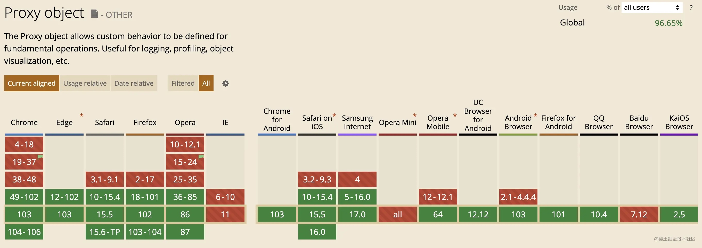

## Vue2 和 Vue3 怎么选择？

对于 vue2 和 vue3 的选择，主要需要考虑的点还是在 vue3 的兼容性上。

vue3 兼容性的限制取决于浏览器对 Proxy 对象的支持。而且这个不兼容无法通过 babel 抹除。

proxy 的兼容性：



## vue2.7 的特性

下面先看看 vue2.7 向后兼容的特性：

> 把 @vue/composition-api 合并进 Vue 2。这会让使用 Composition API 开发的库同时支持 Vue2 和 Vue3。
> 单文件组件中的 `<script setup>` 语法。
> 提升的 TypeScript 类型支持。
> 正式在 Vite 中支持 Vue 2，新增官方的@vitejs/plugin-vue2 插件(2.6 的支持是通过非官方插件 vite-plugin-vue 实现的)

## 创建 vue2.7 的 ts 项目

vite 没支持直接创建 vue2 项目，我们直接用 vite 创建一个 vue3+ts 的项目就可以，然后再修改 vue 的版本为 2.7.x。
可以看到.vue 文件已经是用上和`组合式api`和 `<script setup>` 语法糖，我们不需要再做修改。
需要注意 vue 对象中没有 createApp，如果要用，还是得引入`@vue/composition-api`。
（2.6 版本：需要引入`@vue/composition-api`，修改`ref`从`@vue/composition-api`引入）

```html
<script setup lang="ts">
  import { ref } from 'vue'

  defineProps<{ msg: string }>()

  const count = ref(0)
</script>

<template>
  <h1>{{ msg }}</h1>

  <div class="card">
    <button type="button" @click="count++">count is {{ count }}</button>
    <p>
      Edit
      <code>components/HelloWorld.vue</code> to test HMR
    </p>
  </div>
</template>

<style scoped>
  .read-the-docs {
    color: #888;
  }
</style>
```

## vite 支持 vue2

vite 支持 vue2 需要用到`@vitejs/plugin-vue2`插件。

```js
//vite.config.ts
import { defineConfig } from 'vite';
import vue from '@vitejs/plugin-vue2';

export default defineConfig({
  plugins: [
    vue(),
  ],
}
```

## ESLint 和 TypeScript 配置

`eslint-plugin-vue`需要升级到 9.x 版本，同时 ts 配置文件加上下面的代码，否则`<template>`标签中的变量会报未定义的错误。

```json
//tsconfig.json
"vueCompilerOptions": {
	"target": 2.7
}
```

## vue2.7 的限制

以下功能已明确不会进行移植：

- `createApp()`（Vue 2 没有独立的 app scope）
- Top-level `await` in `<script setup>`（Vue 2 不支持异步组件初始化）
- 在模板表达式中支持 TypeScript 语法（不兼容 w/ Vue 2 解析器）
- 响应式转换 Reactivity transform（仍处于实验性阶段）
- `expose` 选项不支持 options 组件（但 `<script setup>` 支持 `defineExpose()` )

## 兼容更多的浏览器版本

`npm run build`查看构建产生的文件，我们可以发现其 js 文件是作为 module 模块引入的，这是因为 vite 默认支持的浏览器基线是支持 ESM 的现代浏览器。

[ESM 兼容性](https://caniuse.com/es6-module)

所以像 IE 11 这种传统浏览器是不支持的。

### 兼容传统浏览器

测试兼容性可以用下面这个在线工具：测试浏览器兼容性的在线工具](https://app.lambdatest.com/console/realtime/browser)

为了兼容 IE11，我们需要用到`@vitejs/plugin-legacy`这个插件，我们先按官网的方式引入。

```js
// vite.config.ts
import legacy from '@vitejs/plugin-legacy'

export default {
  plugins: [
    legacy({
      targets: ['defaults'],
    }),
  ],
}
```

### 兼容停止维护的浏览器

target 值的知识，参考`browserslist`。
发现在 IE 11 依旧白屏，我们看看`defaults`的值是什么：`> 0.5%, last 2 versions, Firefox ESR, not dead`
IE 11 已经停止维护，已经被排除在`not dead`之外。
稍微修改一下 target 的值`targets: ['> 0.01%, last 10 versions, Firefox ESR']`。
可以了！
